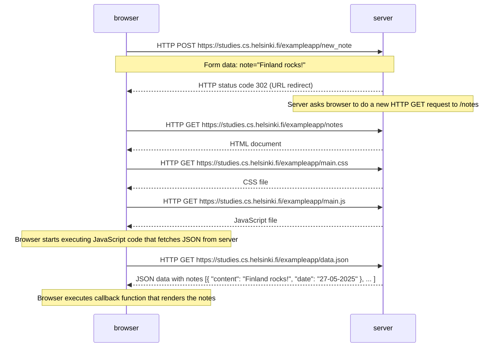
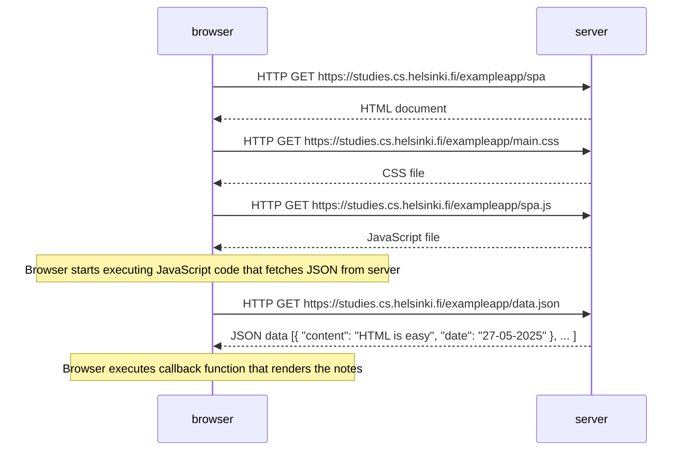
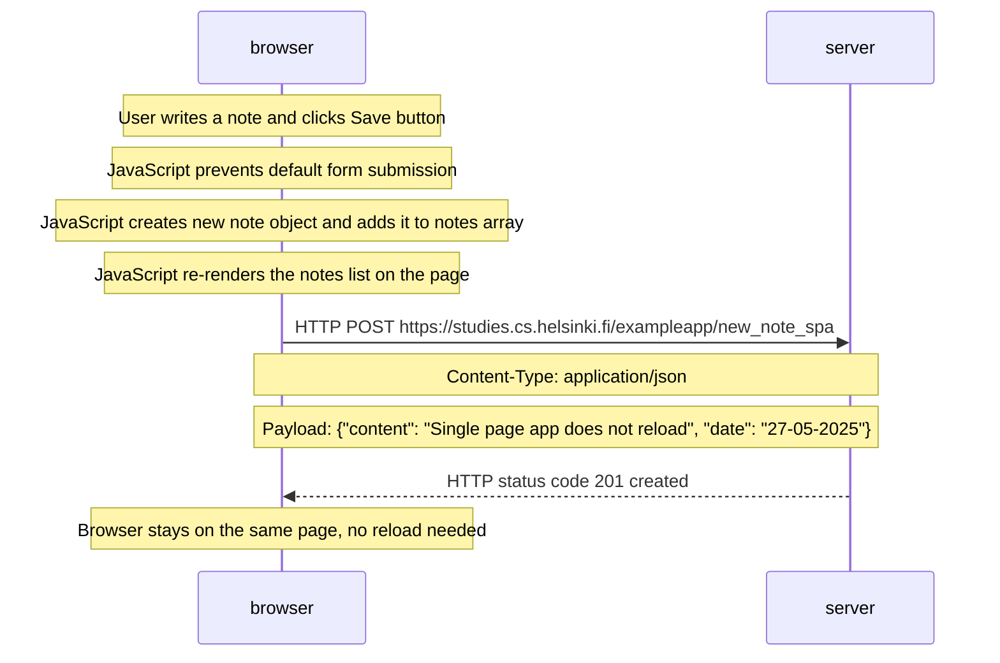

## Exercise 0.4: New note

```mermaid
sequenceDiagram
    participant browser
    participant server

    browser->>server: HTTP POST https://studies.cs.helsinki.fi/exampleapp/new_note
    Note over browser,server: Form data: note="Finland rocks!"
    server-->>browser: HTTP status code 302 (URL redirect)
    Note over server: Server asks browser to do a new HTTP GET request to /notes
    
    browser->>server: HTTP GET https://studies.cs.helsinki.fi/exampleapp/notes
    server-->>browser: HTML document
    
    browser->>server: HTTP GET https://studies.cs.helsinki.fi/exampleapp/main.css
    server-->>browser: CSS file
    
    browser->>server: HTTP GET https://studies.cs.helsinki.fi/exampleapp/main.js
    server-->>browser: JavaScript file
    
    Note over browser: Browser starts executing JavaScript code that fetches JSON from server
    
    browser->>server: HTTP GET https://studies.cs.helsinki.fi/exampleapp/data.json
    server-->>browser: JSON data with notes [{ "content": "Finland rocks!", "date": "27-05-2025" }, ... ]
    
    Note over browser: Browser executes callback function that renders the notes
```

## Exercise 0.5: Single page app

```mermaid
sequenceDiagram
    participant browser
    participant server

    browser->>server: HTTP GET https://studies.cs.helsinki.fi/exampleapp/spa
    server-->>browser: HTML document
    
    browser->>server: HTTP GET https://studies.cs.helsinki.fi/exampleapp/main.css
    server-->>browser: CSS file
    
    browser->>server: HTTP GET https://studies.cs.helsinki.fi/exampleapp/spa.js
    server-->>browser: JavaScript file
    
    Note over browser: Browser starts executing JavaScript code that fetches JSON from server
    
    browser->>server: HTTP GET https://studies.cs.helsinki.fi/exampleapp/data.json
    server-->>browser: JSON data [{ "content": "HTML is easy", "date": "27-05-2025" }, ... ]
    
    Note over browser: Browser executes callback function that renders the notes
```

## Exercise 0.6: New note in SPA

```mermaid
sequenceDiagram
    participant browser
    participant server

    Note over browser: User writes a note and clicks Save button
    Note over browser: JavaScript prevents default form submission
    Note over browser: JavaScript creates new note object and adds it to notes array
    Note over browser: JavaScript re-renders the notes list on the page
    
    browser->>server: HTTP POST https://studies.cs.helsinki.fi/exampleapp/new_note_spa
    Note over browser,server: Content-Type: application/json
    Note over browser,server: Payload: {"content": "Single page app does not reload", "date": "27-05-2025"}
    server-->>browser: HTTP status code 201 created
    
    Note over browser: Browser stays on the same page, no reload needed
```